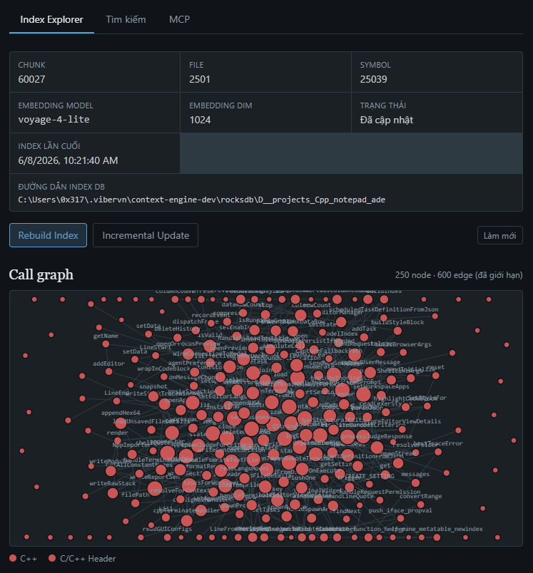
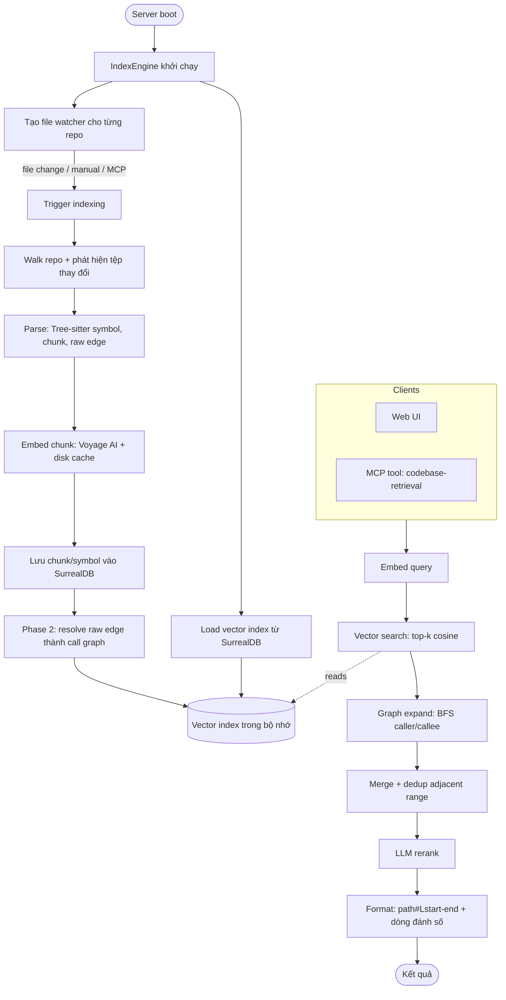

# vibervn-context-engine

[English](README.md) · **Tiếng Việt** · [中文](README-zh.md)



## Cài đặt & Chạy

Chạy bản phát hành mới nhất trực tiếp bằng npx — không cần tải thủ công, npx
sẽ tự động lấy đúng bản binary đã biên dịch sẵn cho nền tảng của bạn. Thẻ
`@latest` buộc npx lấy phiên bản mới nhất đã phát hành thay vì dùng lại bản
cache cũ:

```bash
npx vibervn-context-engine@latest
```

Lệnh này khởi động HTTP server ở cổng 6699 (Web UI tại
http://127.0.0.1:6699, MCP endpoint tại `/mcp`). Mọi cờ CLI đều được chuyển
tiếp tới binary:

```bash
npx vibervn-context-engine@latest --port 8080 --bind 0.0.0.0
```

Hoặc cài đặt toàn cục để có lệnh `vibervn-context-engine` cố định:

```bash
npm install -g vibervn-context-engine@latest
vibervn-context-engine --port 6699
```

Nền tảng được hỗ trợ: Linux x64/arm64, macOS arm64, Windows x64.

## Tính năng

| Tính năng | Mô tả |
|-----------|-------|
| Semantic code search | Tìm mã theo ý nghĩa thông qua embedding, không khớp văn bản thuần |
| Multi-language parsing | Extract symbol bằng Tree-sitter cho 22 ngôn ngữ (xem bảng bên dưới) |
| Call-graph expansion | Resolve caller/callee edge và BFS expand các symbol khớp khi query |
| Import-path resolution | Trace import tới file thật cho TS/JS, Python, Go, Rust — resolve cross-module call mà name matching bỏ lỡ |
| Framework-aware resolution | Phát hiện React, Express, Django, Spring, Go Gin và tạo routing/DI/rendering edge tự động |
| Generated-file detection | Downrank protobuf stub, gRPC scaffolding, mock, codegen output — hand-written code hiển thị trước |
| Field-qualified search | Filter kết quả bằng prefix `kind:function`, `lang:rust`, `path:src/api`, `name:Handler` trong query |
| Enriched caller/callee output | Kết quả MCP hiển thị tên symbol `[callers: fn_a, fn_b +N more]` thay vì chỉ số đếm |
| Incremental indexing | Chỉ re-index các tệp đã thay đổi (mtime + watcher), crash-safe nhờ commit marker theo từng tệp |
| Real-time file watching | `notify` (debounce) tự động trigger re-index khi tệp thay đổi |
| Voyage AI embedding | HTTP embedding client có disk cache để tránh gọi API thừa |
| LLM rerank | Sắp xếp lại các candidate chunk bằng LLM (OpenAI / Google); tùy chọn, có thể tắt |
| Embedded SurrealDB | Lưu chunk, symbol và edge; một datastore cho mỗi repo |
| HTTP API + Web UI | Quản lý cấu hình, index explorer và bảng điều khiển thử query |
| MCP server | Cung cấp `codebase-retrieval` và `file-retrieval` tool qua streamable HTTP |
| SSE progress stream | Truyền sự kiện indexing progress trực tiếp tới UI |
| Large-repo scaling | Bounded memory và không có đường O(n²) — xây dựng cho codebase quy mô Linux/Chromium |

## Ngôn ngữ được hỗ trợ

Việc extract symbol bằng Tree-sitter (hàm, lớp, phương thức và call edge)
được hiện thực riêng cho từng ngôn ngữ. Phần mở rộng tệp được ánh xạ trong
`detect_language` (`src/parsing/mod.rs`).

| Ngôn ngữ | Phần mở rộng | Grammar |
|----------|--------------|---------|
| Python | `.py` | `tree-sitter-python` |
| JavaScript | `.js`, `.jsx`, `.mjs`, `.cjs` | `tree-sitter-javascript` |
| TypeScript | `.ts` | `tree-sitter-typescript` |
| TSX | `.tsx` | `tree-sitter-javascript` |
| Rust | `.rs` | `tree-sitter-rust` |
| Go | `.go` | `tree-sitter-go` |
| Java | `.java` | `tree-sitter-java` |
| C | `.c` | `tree-sitter-c` |
| C++ | `.cpp`, `.cc`, `.cxx`, `.h`, `.hpp`, `.hxx`, `.hh` | `tree-sitter-cpp` |
| C# | `.cs` | `tree-sitter-c-sharp` |
| PHP | `.php` | `tree-sitter-php` |
| Ruby | `.rb` | `tree-sitter-ruby` |
| Objective-C | `.m`, `.mm` | `tree-sitter-objc` |
| Swift | `.swift` | `tree-sitter-swift` |
| Kotlin | `.kt`, `.kts` | `tree-sitter-kotlin` |
| Dart | `.dart` | `tree-sitter-dart` |
| Lua | `.lua` | `tree-sitter-lua` |
| Luau | `.luau` | `tree-sitter-luau` |
| Svelte | `.svelte` | `tree-sitter-javascript` (script block) |
| Pascal | `.pas`, `.pp`, `.dpr`, `.lpr`, `.dpk` | `tree-sitter-pascal` |
| Liquid | `.liquid` | `tree-sitter-liquid` |

Tệp có phần mở rộng khác vẫn được chia chunk và embedding để tìm kiếm ngữ nghĩa,
nhưng không extract symbol hay call edge từ chúng.

## Cách hoạt động



## Đóng góp

Chúng tôi hoan nghênh các **feature request được mô tả bằng văn bản** — hãy mở
một issue mô tả hành vi bạn mong muốn, và chúng tôi sẽ cân nhắc đưa vào roadmap.

Hiện tại chúng tôi **chưa nhận các pull request có chứa code**, **ngoại trừ duy
nhất bug fix**. Nếu bạn muốn đề xuất một tính năng mới, vui lòng tạo một
feature-request issue thay vì gửi PR code. Các PR bug fix (kèm mô tả rõ ràng về
bug và cách sửa) thì luôn được hoan nghênh.
