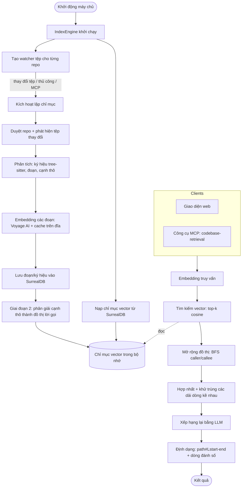

# vibervn-context-engine

[English](README.md) · **Tiếng Việt** · [中文](README-zh.md)


## Cài đặt & Chạy

Chạy bản phát hành mới nhất trực tiếp bằng npx — không cần tải thủ công, npx
sẽ tự động lấy đúng bản binary đã biên dịch sẵn cho nền tảng của bạn. Thẻ
`@latest` buộc npx lấy phiên bản mới nhất đã phát hành thay vì dùng lại bản
cache cũ:

```bash
npx vibervn-context-engine@latest
```

Lệnh này khởi động máy chủ HTTP ở cổng 6699 (giao diện web tại
http://127.0.0.1:6699, endpoint MCP tại `/mcp`). Mọi cờ CLI đều được chuyển
tiếp tới binary:

```bash
npx vibervn-context-engine@latest --port 8080 --bind 0.0.0.0
```

Hoặc cài đặt toàn cục để có lệnh `vibervn-context-engine` cố định:

```bash
npm install -g vibervn-context-engine@latest
vibervn-context-engine --port 6699
```

Nền tảng được hỗ trợ: Linux x64/arm64, macOS arm64, Windows x64.

## Tính năng

| Tính năng | Mô tả |
|-----------|-------|
| Tìm kiếm mã ngữ nghĩa | Tìm mã theo ý nghĩa thông qua embedding, không khớp văn bản thuần |
| Phân tích đa ngôn ngữ | Trích xuất ký hiệu bằng Tree-sitter cho Python, JavaScript, TypeScript, Rust, Go, Java, C và C++ |
| Mở rộng đồ thị lời gọi | Phân giải cạnh caller/callee và mở rộng BFS các ký hiệu khớp khi truy vấn |
| Lập chỉ mục tăng dần | Chỉ lập lại chỉ mục cho tệp đã thay đổi (mtime + watcher), an toàn khi sập nhờ marker commit theo từng tệp |
| Theo dõi tệp thời gian thực | `notify` (chống dội) tự động kích hoạt lập lại chỉ mục khi tệp thay đổi |
| Embedding Voyage AI | Client embedding qua HTTP có cache trên đĩa để tránh gọi API thừa |
| Xếp hạng lại bằng LLM | Sắp xếp lại các đoạn ứng viên bằng LLM (OpenAI / Google); tùy chọn, có thể tắt |
| SurrealDB nhúng | Lưu các đoạn, ký hiệu và cạnh; một kho dữ liệu cho mỗi repo |
| HTTP API + Giao diện web | Quản lý cấu hình, trình khám phá chỉ mục và bảng điều khiển thử truy vấn |
| Máy chủ MCP | Cung cấp một công cụ duy nhất `codebase-retrieval` qua HTTP streamable |
| Luồng tiến trình SSE | Truyền sự kiện tiến trình lập chỉ mục trực tiếp tới giao diện |
| Mở rộng repo lớn | Bộ nhớ có giới hạn và không có đường O(n²) — xây dựng cho codebase quy mô Linux/Chromium |

## Ngôn ngữ được hỗ trợ

Việc trích xuất ký hiệu bằng Tree-sitter (hàm, lớp, phương thức và cạnh lời gọi)
được hiện thực riêng cho từng ngôn ngữ. Phần mở rộng tệp được ánh xạ trong
`detect_language` (`src/parsing/mod.rs`).

| Ngôn ngữ | Phần mở rộng | Grammar |
|----------|--------------|---------|
| Python | `.py` | `tree-sitter-python` |
| JavaScript | `.js`, `.jsx`, `.mjs`, `.cjs` | `tree-sitter-javascript` |
| TypeScript | `.ts` | `tree-sitter-typescript` |
| TSX | `.tsx` | `tree-sitter-javascript` |
| Rust | `.rs` | `tree-sitter-rust` |
| Go | `.go` | `tree-sitter-go` |
| Java | `.java` | `tree-sitter-java` |
| C | `.c` | `tree-sitter-c` |
| C++ | `.cpp`, `.cc`, `.cxx`, `.h`, `.hpp`, `.hxx`, `.hh` | `tree-sitter-cpp` |

Tệp có phần mở rộng khác vẫn được chia đoạn và embedding để tìm kiếm ngữ nghĩa,
nhưng không trích xuất ký hiệu hay cạnh lời gọi từ chúng.

## Cách hoạt động


