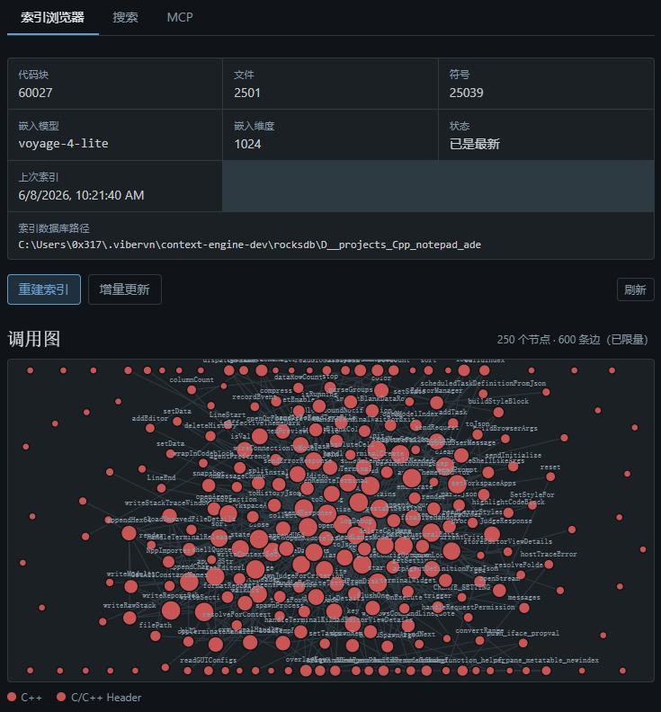
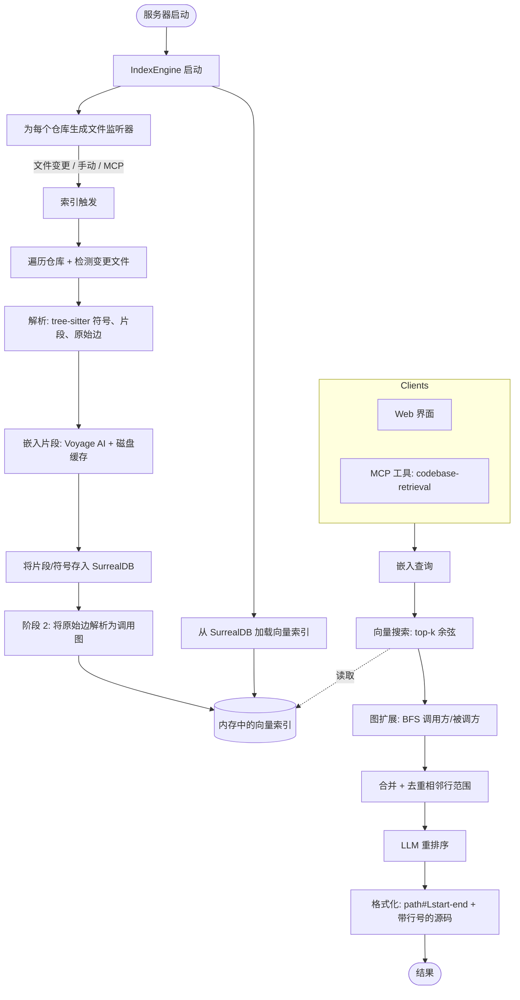

# vibervn-context-engine

[English](README.md) · [Tiếng Việt](README-vi.md) · **中文**



## 安装与运行

通过 npx 直接运行最新发布版 —— 无需手动下载，npx 会自动获取适合你平台的预编译
二进制文件。`@latest` 标签会强制 npx 拉取最新发布版本，而不是复用过期的缓存：

```bash
npx vibervn-context-engine@latest
```

该命令会在 6699 端口启动 HTTP 服务器（Web 界面位于 http://127.0.0.1:6699，
MCP 端点位于 `/mcp`）。所有 CLI 参数都会转发给二进制文件：

```bash
npx vibervn-context-engine@latest --port 8080 --bind 0.0.0.0
```

或者全局安装以获得持久的 `vibervn-context-engine` 命令：

```bash
npm install -g vibervn-context-engine@latest
vibervn-context-engine --port 6699
```

支持的平台：Linux x64/arm64、macOS arm64、Windows x64。

## 功能特性

| 功能 | 描述 |
|------|------|
| 语义代码搜索 | 通过嵌入向量按语义查找代码，而非字面文本匹配 |
| 多语言解析 | 使用 Tree-sitter 为 22 种语言提取符号（见下表） |
| 调用图扩展 | 解析调用方/被调方边，并在查询时对匹配符号进行 BFS 扩展 |
| Import 路径解析 | 为 TS/JS、Python、Go、Rust 追踪 import 到实际文件 —— 解析 name matching 遗漏的跨模块调用 |
| Framework 感知解析 | 检测 React、Express、Django、Spring、Go Gin 并自动生成 routing/DI/rendering 边 |
| Generated-file 检测 | 降权 protobuf stub、gRPC scaffolding、mock、codegen 输出，手写代码优先显示 |
| Field-qualified search | 使用 `kind:function`、`lang:rust`、`path:src/api`、`name:Handler` 前缀过滤结果 |
| Enriched caller/callee 输出 | MCP 结果显示符号名 `[callers: fn_a, fn_b +N more]` 而非仅数字 |
| 增量索引 | 仅重新索引已变更的文件（mtime + 监听器），通过逐文件提交标记实现崩溃安全 |
| 实时文件监听 | `notify`（带去抖）在文件变更时自动触发重新索引 |
| Voyage AI 嵌入 | 带磁盘缓存的 HTTP 嵌入客户端，避免重复 API 调用 |
| LLM 重排序 | 使用 LLM（OpenAI / Google）对候选片段重新排序；可选，可禁用 |
| 内嵌 SurrealDB | 存储片段、符号和边；每个仓库一个数据存储 |
| HTTP API + Web 界面 | 配置管理、索引浏览器和查询测试控制台 |
| MCP 服务器 | 通过可流式 HTTP 暴露 `codebase-retrieval` 和 `file-retrieval` 工具 |
| SSE 进度流 | 将实时索引进度事件流式传输到界面 |
| 大型仓库扩展 | 内存有界且无 O(n²) 路径 —— 为 Linux/Chromium 规模的代码库而构建 |

## 支持的语言

Tree-sitter 符号提取（函数、类、方法和调用边）按语言分别实现。文件扩展名在
`detect_language`（`src/parsing/mod.rs`）中映射。

| 语言 | 扩展名 | 语法 |
|------|--------|------|
| Python | `.py` | `tree-sitter-python` |
| JavaScript | `.js`、`.jsx`、`.mjs`、`.cjs` | `tree-sitter-javascript` |
| TypeScript | `.ts` | `tree-sitter-typescript` |
| TSX | `.tsx` | `tree-sitter-javascript` |
| Rust | `.rs` | `tree-sitter-rust` |
| Go | `.go` | `tree-sitter-go` |
| Java | `.java` | `tree-sitter-java` |
| C | `.c` | `tree-sitter-c` |
| C++ | `.cpp`、`.cc`、`.cxx`、`.h`、`.hpp`、`.hxx`、`.hh` | `tree-sitter-cpp` |
| C# | `.cs` | `tree-sitter-c-sharp` |
| PHP | `.php` | `tree-sitter-php` |
| Ruby | `.rb` | `tree-sitter-ruby` |
| Objective-C | `.m`、`.mm` | `tree-sitter-objc` |
| Swift | `.swift` | `tree-sitter-swift` |
| Kotlin | `.kt`、`.kts` | `tree-sitter-kotlin` |
| Dart | `.dart` | `tree-sitter-dart` |
| Lua | `.lua` | `tree-sitter-lua` |
| Luau | `.luau` | `tree-sitter-luau` |
| Svelte | `.svelte` | `tree-sitter-javascript`（script block） |
| Pascal | `.pas`、`.pp`、`.dpr`、`.lpr`、`.dpk` | `tree-sitter-pascal` |
| Liquid | `.liquid` | `tree-sitter-liquid` |

其他扩展名的文件仍会被分块并嵌入以供语义搜索，但不会从中提取符号或调用边。

## 工作原理



## 贡献

我们欢迎**以文字描述的 feature request** —— 请提交一个 issue 描述你期望的行为，
我们会考虑将其纳入路线图。

目前我们**不接受包含代码的 pull request**，**唯一的例外是 bug fix**。如果你想
提议一个新功能，请提交 feature-request issue，而不是代码 PR。bug fix PR（附带
对 bug 及修复方式的清晰描述）始终欢迎。
