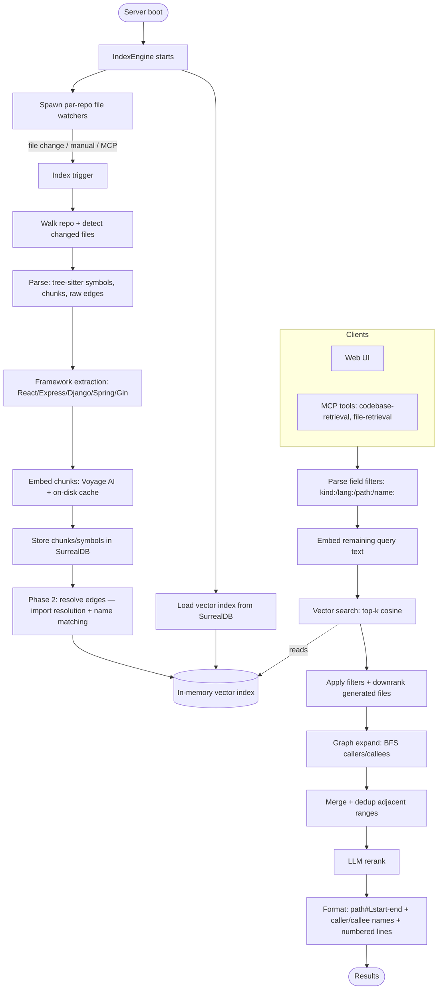

# vibervn-context-engine

**English** · [Tiếng Việt](README-vi.md) · [中文](README-zh.md)


## Install & Run

Run the latest release directly with npx — no manual download, the correct
prebuilt binary for your platform is fetched automatically. The `@latest`
tag forces npx to fetch the newest published version instead of reusing a
stale cached one:

```bash
npx vibervn-context-engine@latest
```

This boots the HTTP server on port 6699 (web UI at http://127.0.0.1:6699,
MCP endpoint at `/mcp`). Any CLI flags are forwarded to the binary:

```bash
npx vibervn-context-engine@latest --port 8080 --bind 0.0.0.0
```

Or install it globally to get a persistent `vibervn-context-engine` command:

```bash
npm install -g vibervn-context-engine@latest
vibervn-context-engine --port 6699
```

Supported platforms: Linux x64/arm64, macOS arm64, Windows x64.

## Features

| Feature | Description |
|---------|-------------|
| Semantic code search | Finds code by meaning via embeddings, not literal text matching |
| Multi-language parsing | Tree-sitter symbol extraction for 22 languages (see table below) |
| Call-graph expansion | Resolves caller/callee edges and BFS-expands matched symbols at query time |
| Import-path resolution | Traces imports to actual files for TS/JS, Python, Go, and Rust — resolves cross-module calls that name matching misses |
| Framework-aware resolution | Detects React, Express, Django, Spring, Go Gin and produces routing/DI/rendering edges automatically |
| Generated-file detection | Downranks protobuf stubs, gRPC scaffolding, mocks, and codegen outputs so hand-written code surfaces first |
| Field-qualified search | Filter results with `kind:function`, `lang:rust`, `path:src/api`, `name:Handler` prefixes in queries |
| Enriched caller/callee output | MCP results show symbol names `[callers: fn_a, fn_b +N more]` instead of bare counts |
| Incremental indexing | Re-indexes only changed files (mtime + watcher), crash-safe via per-file commit markers |
| Real-time file watching | `notify` (debounced) triggers re-index automatically on file changes |
| Voyage AI embeddings | HTTP embedding client with an on-disk cache to avoid redundant API calls |
| LLM reranking | Reorders candidate chunks with an LLM (OpenAI / Google); optional, can be disabled |
| Embedded SurrealDB | Stores chunks, symbols, and edges; one datastore per repo |
| HTTP API + Web UI | Settings management, index explorer, and a query test console |
| MCP server | Exposes `codebase-retrieval` and `file-retrieval` tools over streamable HTTP |
| SSE progress stream | Streams live indexing progress events to the UI |
| Large-repo scaling | Bounded memory and no O(n²) paths — built for Linux/Chromium-scale codebases |

## Supported Languages

Tree-sitter symbol extraction (functions, classes, methods, and call edges) is
implemented per language. File extensions are mapped in `detect_language`
(`src/parsing/mod.rs`).

| Language | Extensions | Grammar |
|----------|------------|---------|
| Python | `.py` | `tree-sitter-python` |
| JavaScript | `.js`, `.jsx`, `.mjs`, `.cjs` | `tree-sitter-javascript` |
| TypeScript | `.ts` | `tree-sitter-typescript` |
| TSX | `.tsx` | `tree-sitter-javascript` |
| Rust | `.rs` | `tree-sitter-rust` |
| Go | `.go` | `tree-sitter-go` |
| Java | `.java` | `tree-sitter-java` |
| C | `.c` | `tree-sitter-c` |
| C++ | `.cpp`, `.cc`, `.cxx`, `.h`, `.hpp`, `.hxx`, `.hh` | `tree-sitter-cpp` |
| C# | `.cs` | `tree-sitter-c-sharp` |
| PHP | `.php` | `tree-sitter-php` |
| Ruby | `.rb` | `tree-sitter-ruby` |
| Objective-C | `.m`, `.mm` | `tree-sitter-objc` |
| Swift | `.swift` | `tree-sitter-swift` |
| Kotlin | `.kt`, `.kts` | `tree-sitter-kotlin` |
| Dart | `.dart` | `tree-sitter-dart` |
| Lua | `.lua` | `tree-sitter-lua` |
| Luau | `.luau` | `tree-sitter-luau` |
| Svelte | `.svelte` | `tree-sitter-javascript` (script block) |
| Pascal | `.pas`, `.pp`, `.dpr`, `.lpr`, `.dpk` | `tree-sitter-pascal` |
| Liquid | `.liquid` | `tree-sitter-liquid` |

Files with any other extension are chunked and embedded for semantic search,
but no symbols or call edges are extracted from them.

## How It Works



## Contributing

We welcome **feature requests described in prose** — open an issue describing the
behavior you'd like to see, and we'll consider it for the roadmap.

At this time we are **not accepting pull requests that contain code**, with the
**sole exception of bug fixes**. If you'd like to propose a new feature, please
file a feature-request issue rather than a code PR. Bug-fix PRs (with a clear
description of the bug and the fix) are welcome.
