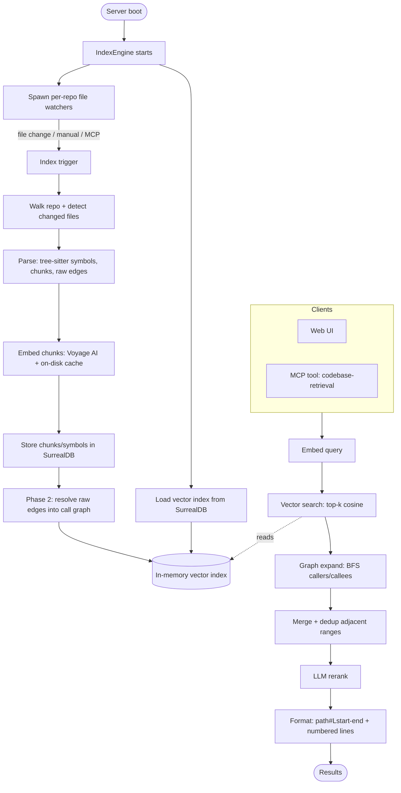

# context-engine-rs

## Install & Run

Run the latest release directly with npx — no manual download, the correct
prebuilt binary for your platform is fetched automatically:

```bash
npx vibervn-context-engine
```

This boots the HTTP server on port 6699 (web UI at http://127.0.0.1:6699,
MCP endpoint at `/mcp`). Any CLI flags are forwarded to the binary:

```bash
npx vibervn-context-engine --port 8080 --bind 0.0.0.0
```

Or install it globally to get a persistent `vibervn-context-engine` command:

```bash
npm install -g vibervn-context-engine
vibervn-context-engine --port 6699
```

Supported platforms: Linux x64/arm64, macOS arm64, Windows x64.

## Features

| Feature | Description |
|---------|-------------|
| Semantic code search | Finds code by meaning via embeddings, not literal text matching |
| Multi-language parsing | Tree-sitter symbol extraction for Python, JavaScript, TypeScript, Rust, Go, and Java |
| Call-graph expansion | Resolves caller/callee edges and BFS-expands matched symbols at query time |
| Incremental indexing | Re-indexes only changed files (mtime + watcher), crash-safe via per-file commit markers |
| Real-time file watching | `notify` (debounced) triggers re-index automatically on file changes |
| Voyage AI embeddings | HTTP embedding client with an on-disk cache to avoid redundant API calls |
| LLM reranking | Reorders candidate chunks with an LLM (OpenAI / Google); optional, can be disabled |
| Embedded SurrealDB | Stores chunks, symbols, and edges; one datastore per repo |
| HTTP API + Web UI | Settings management, index explorer, and a query test console |
| MCP server | Exposes a single `codebase-retrieval` tool over streamable HTTP |
| SSE progress stream | Streams live indexing progress events to the UI |
| Large-repo scaling | Bounded memory and no O(n²) paths — built for Linux/Chromium-scale codebases |

## How It Works


